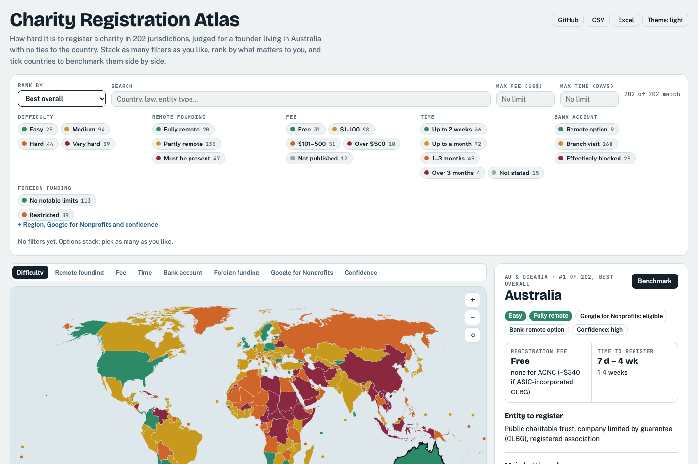
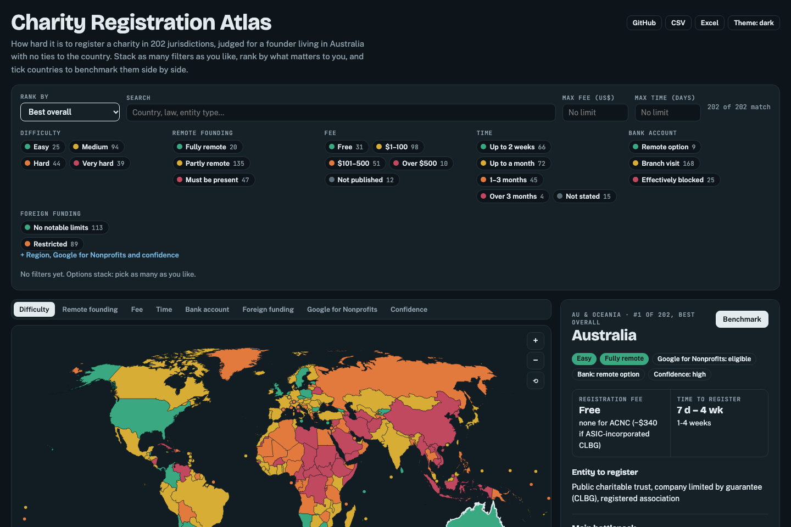
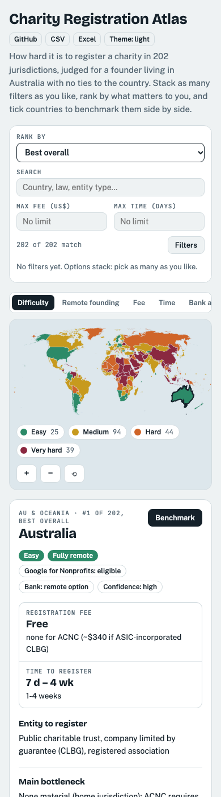
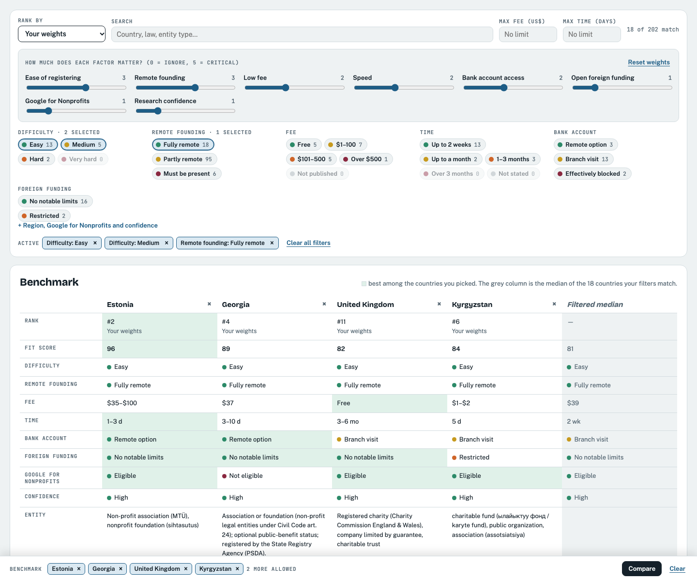

<div align="center">

# 🌍 OpenCharity · Charity Registration Atlas

### How hard is it to register a charity in every country on Earth, from Australia?

**202 jurisdictions · 18 researched dimensions · every claim source-cited · re-verified October 2026**

[](https://opencharity-org.github.io/OpenCharity/)
[](https://github.com/OpenCharity-org/OpenCharity/raw/main/charities_by_country_v2.csv)
[](https://github.com/OpenCharity-org/OpenCharity/raw/main/charities_by_country_v2.xlsx)

[](#-at-a-glance)
[](#-at-a-glance)
[](#-at-a-glance)
[](#-at-a-glance)
[](#-at-a-glance)
[](#-at-a-glance)
[](#-google-for-nonprofits)
<br>
[](#-how-it-was-researched)
[](#-how-it-was-researched)
[](https://opencharity-org.github.io/OpenCharity/)
[](#-screenshots)
[](#%EF%B8%8F-run-it-yourself)
[](https://d3js.org/)
[](LICENSE)
[](#-contributing)

<br>

<a href="https://opencharity-org.github.io/OpenCharity/"></a>

</div>

---

## 📚 Contents

- [✨ What you can do](#-what-you-can-do)
- [📸 Screenshots](#-screenshots)
- [📈 At a glance](#-at-a-glance)
- [🏆 Top 10 for an Australian founder](#-top-10-for-an-australian-founder)
- [⚡ Quick answers](#-quick-answers)
- [🧭 Using the atlas](#-using-the-atlas)
- [🗂️ What's in the dataset](#%EF%B8%8F-whats-in-the-dataset)
- [🧮 How rankings are calculated](#-how-rankings-are-calculated)
- [🔬 How it was researched](#-how-it-was-researched)
- [🛠️ Run it yourself](#%EF%B8%8F-run-it-yourself)
- [📁 Repository layout](#-repository-layout)
- [🤝 Contributing](#-contributing)
- [⚠️ Disclaimer](#%EF%B8%8F-disclaimer)
- [📜 License & credits](#-license--credits)

---

## ✨ What you can do

| | Feature | Details |
|---|---|---|
| 🗺️ | **World map** | Every country coloured by difficulty, remote founding, fee, time, bank access, foreign-funding rules, Google for Nonprofits eligibility or research confidence. Micro-states (Tuvalu, Nauru, Monaco…) are shown as dots. Zoom, pan and tap any country. |
| 🏅 | **13 rankings** | Best overall · **your own weights** · easiest / hardest · cheapest / most expensive · fastest / slowest · most remote-friendly · easiest bank account · fewest funding limits · cheap *and* fast · A–Z |
| 🎛️ | **Stackable filters** | Multi-select every facet: options in one group widen the match (Easy **or** Medium), groups narrow it (… **and** fully remote **and** fee ≤ $100). Each option shows a live count of what you would get. Plus free-text search and exact fee/time ceilings. |
| ⚖️ | **Custom weights** | Eight sliders (ease, remote founding, fee, speed, bank access, open foreign funding, Google for Nonprofits, confidence) produce a 0–100 **fit score** for every country. |
| 📊 | **Benchmark** | Tick up to 6 countries to compare side by side. The best value in each row is highlighted, and a **filtered median** column shows how they stack up against the countries your filters match. |
| 📄 | **Country dossier** | Entity type and governing law, main bottleneck, local requirements, cost and time in practice, bank account, tax exemption, donor deductions, foreign-funding rules, annual compliance, research notes and every source link. |
| 📱 | **Works on phones** | Filters fold away, the ranking becomes cards, and details collapse until you need them. |
| 🌗 | **Light & dark** | Follows your system, or switch with the Theme button. Your filters, picks and weights are remembered in your browser. |

---

## 📸 Screenshots

<table>
<tr>
<td width="62%"><b>🌙 Dark mode</b><br></td>
<td width="38%" rowspan="2"><b>📱 On a phone</b><br></td>
</tr>
<tr>
<td><b>⚖️ Stacked filters, custom weights & benchmark</b><br></td>
</tr>
</table>

> 🔁 Screenshots are generated by `python3 make_screenshots.py`.

---

## 📈 At a glance

<table>
<tr><td valign="top">

**🎯 Difficulty for an AU-resident founder**

| | Level | Countries |
|---|---|---:|
| 🟢 | Easy | **25** |
| 🟡 | Medium | **94** |
| 🟠 | Hard | **44** |
| 🔴 | Very hard | **39** |

</td><td valign="top">

**🌐 Can you found it remotely?**

| | Remote founding | Countries |
|---|---|---:|
| 🟢 | Fully remote | **20** |
| 🟡 | Partly (local agent / resident officer) | **135** |
| 🔴 | Must be present or barred | **47** |

</td></tr>
<tr><td valign="top">

**💸 Registration fee**

| | Band | Countries |
|---|---|---:|
| 🟢 | Free | **31** |
| 🟡 | $1–100 | **98** |
| 🟠 | $101–500 | **51** |
| 🔴 | Over $500 | **10** |
| ⚪ | Not published | **12** |

</td><td valign="top">

**⏱️ Time to register**

| | Band | Countries |
|---|---|---:|
| 🟢 | Up to 2 weeks | **66** |
| 🟡 | Up to a month | **72** |
| 🟠 | 1–3 months | **45** |
| 🔴 | Over 3 months | **4** |
| ⚪ | Not stated / not possible | **15** |

</td></tr>
<tr><td valign="top">

**🏦 Bank account for a non-resident**

| | Access | Countries |
|---|---|---:|
| 🟢 | Remote option exists | **9** |
| 🟡 | Branch visit needed | **168** |
| 🔴 | Effectively blocked | **25** |

</td><td valign="top">

**🌏 Foreign funding & research quality**

| | | Countries |
|---|---|---:|
| 🟢 | No notable foreign-funding limits | **113** |
| 🟠 | Foreign funding restricted | **89** |
| ✅ | High-confidence rows | **85** |
| ☑️ | Medium-confidence rows | **117** |

</td></tr>
</table>

---

## 🏆 Top 10 for an Australian founder

Ranked by the atlas's **Best overall** score (difficulty, remote founding, Google for Nonprofits eligibility, research confidence; ties broken by fee, then time). All ten are 🟢 easy, fully remote and Google for Nonprofits eligible.

| # | Country | Entity to register | Fee | Time | Bank |
|---:|---|---|---|---|---|
| 1 | 🇦🇺 **Australia** | Charitable trust, company limited by guarantee, incorporated association (ACNC) | Free | 1–4 wk | 🟢 online |
| 2 | 🇨🇿 **Czechia** | Spolek (association), ústav, nadace (foundation) | $0–110 | 2–6 wk | 🟡 visit |
| 3 | 🇿🇦 **South Africa** | Non-profit company (Companies Act 71/2008), trust | Free | ~2 mo | 🟡 visit |
| 4 | 🇬🇧 **United Kingdom** | Registered charity, company limited by guarantee, charitable trust | Free | 3–6 mo | 🟡 visit |
| 5 | 🇰🇬 **Kyrgyzstan** | Charitable fund, public organisation, association | $1–2 | 5 days | 🟡 visit |
| 6 | 🇪🇪 **Estonia** | MTÜ (non-profit association), sihtasutus (foundation) | $35–100 | 1–3 days | 🟢 EMI |
| 7 | 🇺🇸 **United States** | State nonprofit corporation + IRS 501(c)(3) | $100–700 | days, + 3–12 mo IRS | 🟡 visit |
| 8 | 🇸🇨 **Seychelles** | Association (Associations Act 2022, free), foundation (~$200) | Free–$200 | 1–3 wk | 🟡 visit |
| 9 | 🇵🇱 **Poland** | Fundacja, stowarzyszenie (KRS) | $200–475 | 1–3 mo | 🟡 visit |
| 10 | 🇳🇱 **Netherlands** | Stichting, vereniging (ANBI for tax status) | $585–1.6k (notary) | 2–4 wk | 🔴 hard |

> 💡 Prefer cheap and fast? Pick **Rank by → Cheap and fast**, or set your own priorities with **Your weights**.

---

## ⚡ Quick answers

| Question | Answer |
|---|---|
| ⚡ **Fastest registrations** | 🇪🇪 Estonia (1–3 days) · 🇭🇰 Hong Kong (3–5 days) · 🇬🇪 Georgia (3–10 days) · 🇰🇬 Kyrgyzstan (5 days) · 🇦🇷 Argentina · 🇫🇷 France (1–2 weeks) |
| 🆓 **No government fee (31)** | 🇦🇺 Australia · 🇬🇧 UK · 🇿🇦 South Africa · 🇨🇿 Czechia · 🇫🇷 France · 🇸🇪 Sweden · 🇩🇰 Denmark · 🇳🇴 Norway · 🇪🇸 Spain · 🇵🇹 Portugal · 🇮🇹 Italy · 🇺🇦 Ukraine · 🇽🇰 Kosovo and more |
| 🌐 **Fully remote founding (20)** | 🇦🇺 🇺🇸 🇬🇧 🇪🇪 🇨🇿 🇵🇱 🇳🇱 🇧🇪 🇫🇷 🇩🇪 🇦🇹 🇭🇷 🇸🇲 🇬🇪 🇰🇬 🇧🇿 🇸🇹 🇳🇦 🇿🇦 🇸🇨 |
| 🏦 **Bank account without a visit** | 🇦🇺 Australia · 🇳🇿 New Zealand · 🇨🇦 Canada · 🇪🇪 Estonia · 🇱🇹 Lithuania · 🇬🇪 Georgia · 🇦🇲 Armenia · 🇨🇾 Cyprus (EMIs) · 🇵🇰 Pakistan (Roshan Digital) |
| 🚫 **Not on Google for Nonprofits (17)** | Belarus, China, Cuba, Georgia, Greenland, Iran, Kosovo, Liechtenstein, Myanmar, Nepal, North Korea, Russia, Somaliland, South Sudan, Sudan, Syria, Western Sahara |

---

## 🧭 Using the atlas

1. 🔗 **Open** <https://opencharity-org.github.io/OpenCharity/>.
2. 🎯 **Pick a ranking** in *Rank by*. The map recolours to match (e.g. *Cheapest* → fee colours).
3. 🎛️ **Stack filters**: tick as many chips as you like. Watch the counts on each chip and the *Active* tags; remove any tag with ×. On a phone, tap **Filters**.
4. 🗺️ **Click a country** on the map or in the list to open its dossier, including every source link.
5. ⚖️ **Benchmark**: tick the box beside up to 6 countries (or press *Benchmark* in a dossier), then **Compare**.
6. 🎚️ **Tune your weights**: *Rank by → Your weights* shows sliders; the fit score updates live.

> 🔗 Link straight to a country with its name as the anchor, e.g. [`#estonia`](https://opencharity-org.github.io/OpenCharity/#estonia) or [`#greenland`](https://opencharity-org.github.io/OpenCharity/#greenland).

---

## 🗂️ What's in the dataset

`charities_by_country_v2.csv`: **202 rows × 18 columns**, UTF-8.

| # | Column | What it tells you |
|---:|---|---|
| 1 | 🏳️ Country | Jurisdiction (193 UN members + Taiwan, Hong Kong, Macau, Palestine, Kosovo, Vatican City, Western Sahara, Somaliland, Greenland) |
| 2 | 🔵 Google for Nonprofits eligible | Yes / No against the 186-name Google for Nonprofits country list |
| 3 | 🏛️ Main charitable entity types | Entity forms with the governing law (number and year) and registering body |
| 4 | 🎯 Difficulty (AU-resident foreign founder) | easy · medium · hard · very hard |
| 5 | 📋 Key local requirements | Seat, resident officers, founder minimums, nationality rules, documents, language |
| 6 | 💰 Est. cost & time | Realistic end-to-end cost and duration, including agents and notaries |
| 7 | 📝 Notes | Law citations, dated verification notes, caveats (segments separated by ` \| `) |
| 8 | 🌐 Foreign founder (no local presence) | yes (fully remote) · partial (needs local agent/resident officer) · no |
| 9 | 🚧 Main bottleneck (remote foreign founder) | The single thing that blocks or slows you |
| 10 | 💵 Registration fee (USD) | Government fee, US$ first, local currency in brackets |
| 11 | ⏱️ Time to register | Realistic registration duration |
| 12 | 🎁 Charitable deduction regime | Tax relief for local donors |
| 13 | 🌏 Foreign donor / donation restrictions | Foreign-agent laws, approval regimes, levies on foreign funding |
| 14 | 📆 Annual compliance & reporting | Ongoing filings, audits, penalties for non-filing |
| 15 | 🧾 Tax-exempt status & benefits | Path to tax-exempt status and what it gives you |
| 16 | 🏦 Bank account (remote feasibility) | Online / branch visit / blocked, with KYC and AML detail |
| 17 | ✅ Confidence | high · med (no low-confidence rows remain) |
| 18 | 🔗 Sources | Official URLs: laws, gazettes, registries, tax authorities |

📗 **`charities_by_country_v2.xlsx`** is the same data as a styled workbook: a heat-mapped *Master* sheet with filters and frozen header, a *Top-10 Shortlist*, a *Regional Summary* and a *Methodology* sheet.

### 🔵 Google for Nonprofits

Eligibility is computed by exact longest-match tokenisation against Google's 186-name program country list (`gfnp_clean.txt`). **185 of 202** qualify.

---

## 🧮 How rankings are calculated

| Ranking | Formula |
|---|---|
| 🏆 **Best overall** | Penalty score, lower is better: `2×difficulty (0–3) + 2×remote (yes 0 · partial 1 · no 3) + 3 if not on Google for Nonprofits + confidence (high 0 · med 1)`; ties broken by fee, then time. The same score drives the Excel *Top-10*. |
| 🎚️ **Your weights** | `fit = 100 × (1 − Σ wᵢ·penaltyᵢ / Σ wᵢ)` with each factor scaled 0 (best) … 1 (worst); fee and time use percentile rank among countries with a stated value. |
| 💸 **Fee** | The lowest US$ figure in the fee cell (`none`/`free` = 0). A few cells include agent or notary costs; the full text is always shown beside the number. |
| ⏱️ **Time** | The first duration in the time cell, converted to days. |
| 🏦 **Bank access** | Classified from the research note: *remote option* = at least one bank or licensed e-money provider onboards non-residents without a visit. |
| ⚪ **Missing values** | Countries with no published fee or time always rank last and fail a fee or time ceiling. |

---

## 🔬 How it was researched

Every row was built and re-checked by research agents working from **primary sources**: statutes, official gazettes, government registries, tax authorities and central banks. Supporting sources were the ICNL Civic Freedom Monitor and reputable law firms.

| Pass | What happened | Scale |
|---|---|---|
| 1️⃣ Initial research | 16 regional batches researched every jurisdiction | 198 countries |
| 2️⃣ Enrichment | Re-verified entity types, fees, times, presence, deductions and donor rules against registries and NGO-law texts | 32 agents |
| 2️⃣b Gap filling | Deep dives on the weakest rows (e.g. São Tomé Lei 8/2012, Mauritania law 2021-004) | 141 deep dives → **0 low-confidence rows** |
| 3️⃣ Compliance | Annual reporting and audit duties | 10 agents |
| 4️⃣ Tax exemption | Path to tax-exempt status and benefits | 10 agents |
| 5️⃣ Banking | Non-resident account opening (KYC/AML) | 10 agents |
| 🔎 Citation check | Every entity-type law citation verified | 51 fixes |
| 🔗 Link check | Dead source links replaced with live official pages | 13 replaced |
| ♻️ Full re-verification | Law currency, fees, times, presence claims | 131 of 198 rows corrected |
| ♻️ Round 2 | Every medium-confidence row re-checked (`verify-rest-out/r2/`) | 113 rows: 56 corrected, 53 confirmed, 4 unverifiable |
| 🧹 Consistency sweeps | Superseded claims purged from other columns | 65 rows + 23 cells |
| 🌍 Coverage completion | 🇵🇼 Palau · 🇽🇰 Kosovo · 🇨🇻 Cabo Verde · 🇬🇱 Greenland researched and added | 202 jurisdictions |

> 🗺️ Grey shapes on the map are dependent territories (Puerto Rico, the Faroe Islands, New Caledonia…), where charities register under the parent country's law.

---

## 🛠️ Run it yourself

Needs only **Python 3** (plus `openpyxl` for the Excel workbook). The atlas is a single static HTML file: data and map geometry are embedded, and D3 and TopoJSON load from cdnjs.

```bash
git clone https://github.com/OpenCharity-org/OpenCharity.git
cd OpenCharity

# 🌍 open the atlas locally
python3 -m http.server 8734 --directory docs   # → http://localhost:8734
```

**🔄 Data pipeline** (each step is idempotent):

```bash
python3 add_countries.py     # ➕ merge new rows from research/new_countries/*.json
python3 apply_followups.py   # ✅ apply verification results (followup_*.json, r2/result_*.json)
python3 build_xlsx.py        # 📗 styled Excel workbook
python3 build_webapp.py      # 🧾 simple list explorer → webapp/index.html
python3 build_atlas.py       # 🗺️ map atlas → webapp/atlas.html + docs/index.html (GitHub Pages)
python3 make_screenshots.py  # 📸 README screenshots (macOS + Google Chrome)
```

<details>
<summary>📜 Earlier pipeline stages (historical)</summary>

```bash
python3 merge.py             # regenerate v1 from workflow-result.json
python3 merge_enrich.py      # fold enrich-out/*.json into v2
python3 apply_verify_rest.py # apply verify_rest_patches.py (round-1 re-verification)
```

</details>

🚀 **Deploying:** GitHub Pages serves `docs/` from `main`. Rebuild with `build_atlas.py`, commit and push, and the site updates in about a minute.

---

## 📁 Repository layout

```text
OpenCharity/
├── 📊 charities_by_country_v2.csv     # master dataset (202 × 18)
├── 📗 charities_by_country_v2.xlsx    # styled workbook
├── 🌐 docs/
│   ├── index.html                     # live atlas (GitHub Pages)
│   └── screenshots/                   # README images
├── 🗺️ webapp/
│   ├── atlas.html                     # atlas (same page, embeddable fragment)
│   ├── index.html                     # simple list explorer
│   ├── data.json                      # dataset as JSON
│   └── geo/countries-50m.json         # Natural Earth 1:50m (world-atlas@2.0.2)
├── 🐍 build_atlas.py · build_webapp.py · build_xlsx.py · make_screenshots.py
├── 🐍 add_countries.py · apply_followups.py · apply_verify_rest.py · verify_rest_patches.py
├── 🔬 research/new_countries/         # Palau, Kosovo, Cabo Verde, Greenland rows
├── ✅ verify-rest-out/                # verification results (round 1, follow-ups, r2/)
├── 📦 enrich*-out/ · cite-verify-out/ # raw per-agent research payloads
└── 📚 research/ · raw/ · …            # underlying source material
```

---

## 🤝 Contributing

Found an outdated fee, a repealed law or a better source? 🙌

1. 🐛 **Open an issue** with the country, the column, the correction and an **official source link**.
2. 🔧 **Or send a PR**: add a verification item to `verify-rest-out/followup_<x>.json`:
   ```json
   {"id": "X1", "country": "Estonia", "verdict": "corrected",
    "cell_edits": {"Registration fee (USD)": "~$35 (MTÜ 30 EUR)"},
    "source": "https://…", "finding": "What the official source says."}
   ```
   then run `python3 apply_followups.py && python3 build_xlsx.py && python3 build_atlas.py`.
3. ➕ **New jurisdiction?** Add an 18-key JSON file to `research/new_countries/` and run `python3 add_countries.py`.

---

## ⚠️ Disclaimer

> **This is research, not legal advice.** Fees are approximate government fees; remote registration usually adds professional costs of 1–3×. Laws change: confirm with the registry and a local adviser before filing. Difficulty and remote-founding ratings are judged for **a founder resident in Australia with no ties to the target country**.

---

## 📜 License & credits

- 📜 Code: [MIT](LICENSE). Data: CC BY 4.0 where the underlying sources allow.
- 🗺️ Map geometry: [Natural Earth](https://www.naturalearthdata.com/) via [world-atlas](https://github.com/topojson/world-atlas) · 📈 [D3](https://d3js.org/) · 🧩 [TopoJSON](https://github.com/topojson/topojson-client)
- 🔤 Type: Bricolage Grotesque, Public Sans and JetBrains Mono (Google Fonts)

<div align="center">

**Made with 💚 for founders who want to do good anywhere in the world.**

⭐ Star the repo if it helped you · 🗺️ [Open the atlas](https://opencharity-org.github.io/OpenCharity/)

</div>
